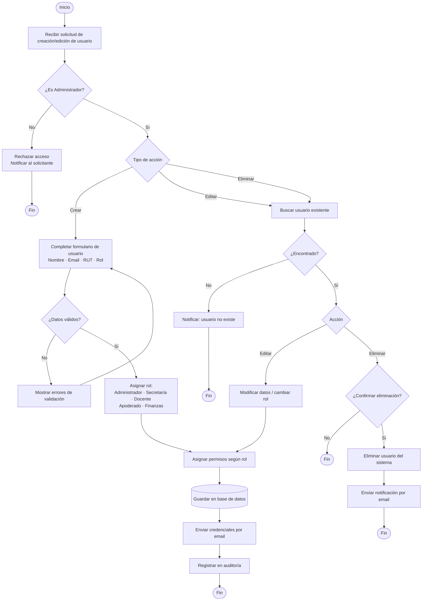
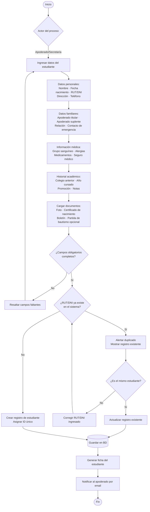
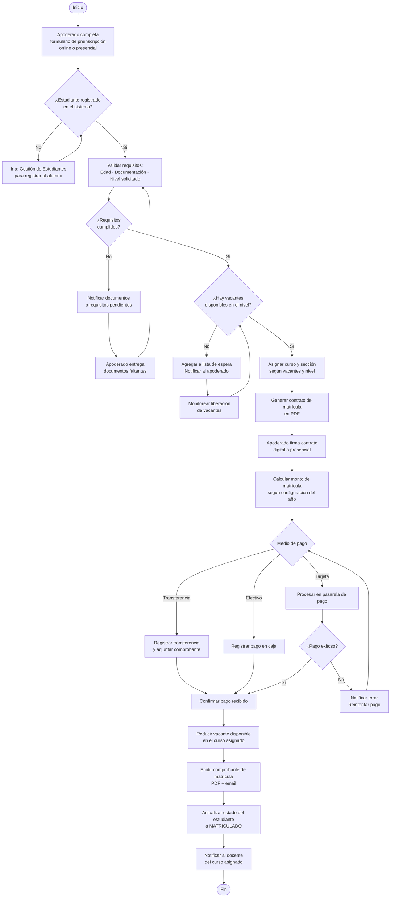
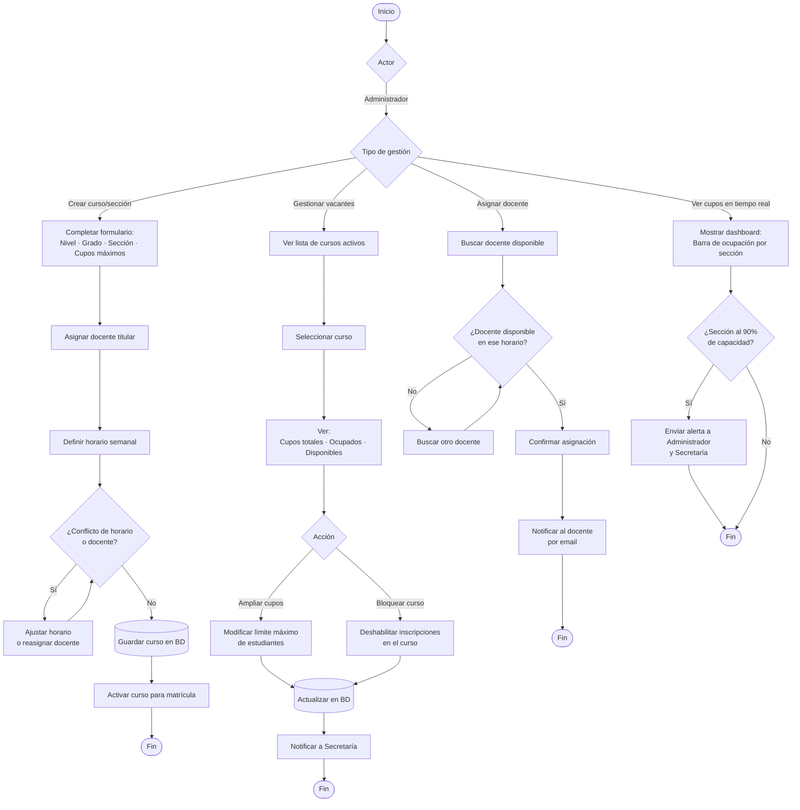
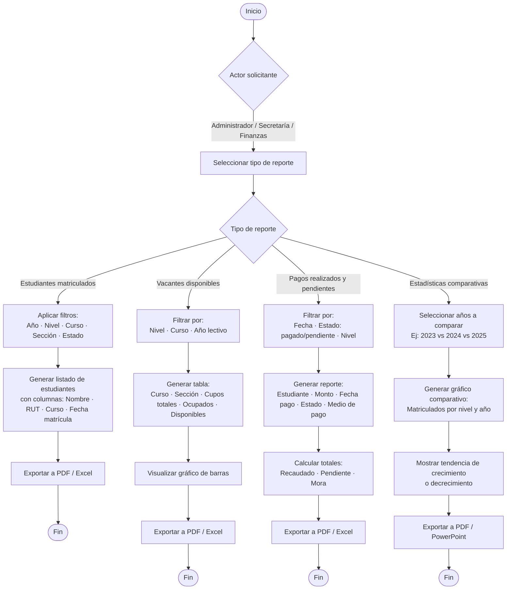
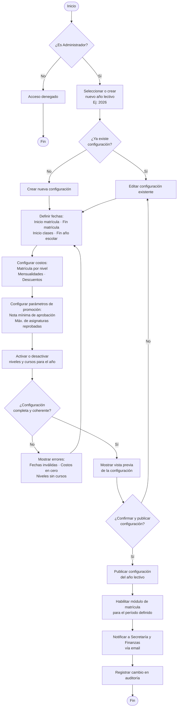
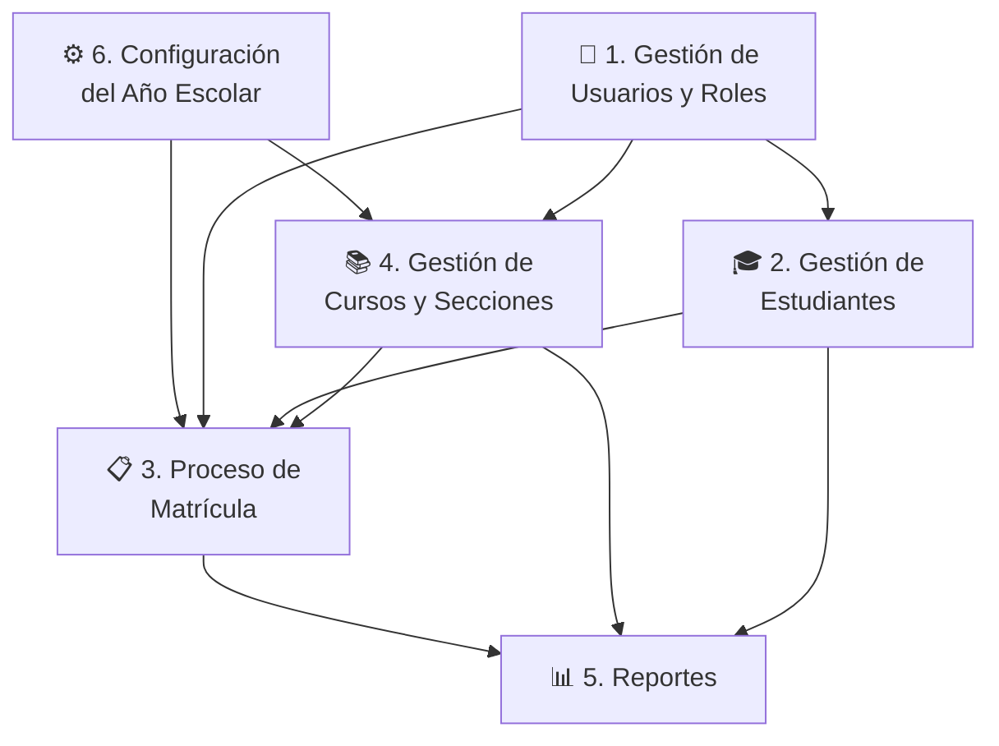

# Diagramas BPMN — Sistema de Matrículas Escolar "Colegio San Andrés"

> Todos los flujos están modelados con notación BPMN usando Mermaid.

---

## 1. Gestión de Usuarios y Roles

---

## 2. Gestión de Estudiantes

---

## 3. Proceso de Matrícula

---

## 4. Gestión de Cursos y Secciones

---

## 5. Reportes

---

## 6. Configuración del Año Escolar

---

## Diagrama General — Interacción entre Módulos

